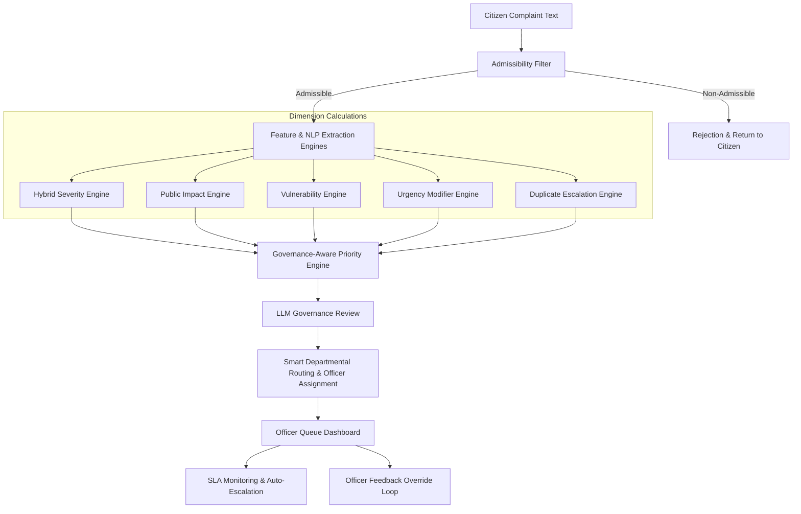

# Sahayak AI - Intelligent NLP-Driven Complaint Triage System

**A Governance-Aware Smart Prioritization, Automated Routing, and Lifecycle Management System for Digital Grievance Portals**

Sahayak AI is a high-performance, intelligent middleware prototype designed to solve the critical operational bottleneck of manual complaint processing in public governance. Instead of traditional FIFO (First-In, First-Out) processing, Sahayak AI acts as an advanced triage layer. It dynamically calculates urgency, extracts infrastructural assets using NER, detects duplicates via FAISS vector search, routes claims to relevant government departments, assigns them to optimal officers based on workload, and enforces strict SLAs—all in real-time.

---

## 🏛️ System Architecture & Triage Pipeline

Sahayak AI processes unstructured citizen complaints through a robust multi-stage NLP and machine learning pipeline, applying governance rules at every stage:



### 1. Admissibility Filter
The first line of defense. The system intercepts and filters out complaints that do not fall under the portal's jurisdiction:
* **Prohibited Domains**: RTI (Right to Information) requests, Subjudice/Court disputes, Domestic/Family conflicts, Religious matters, Government Employee Service matters, and National Security affairs.
* **Mechanism**: A fast keyword-interceptor checks for explicit violations, followed by a trained **Logistic Regression classifier** predicting the category based on **SentenceTransformer** embeddings. Non-admissible complaints are immediately rejected with clear policy citations.

### 2. Category Classification & Smart Routing
Admissible complaints are classified into administrative categories (Health, Public Safety, Corruption, Transport, Electricity, Roads, Education, Water, Sanitation, Other) using a **Logistic Regression classifier**. 
* **Secondary Departments**: Detects if a complaint overlaps with multiple departments.
* **Smart Officer Assignment**: Automatically assigns the complaint to a specific Level-1 (L1) officer within the target department based on:
  - **Location Matching**: Matches extracted Zones and Wards to the officer's jurisdiction.
  - **Workload Balancing**: Avoids officers with $\ge$ 10 active complaints. Tie-breaks using the lowest active workload.

### 3. Named Entity Recognition (NER) & Asset Extraction
Powered by **spaCy** (`en_core_web_sm`) and custom regex matchers, the system extracts critical metadata:
* **Locations**: Identifies cities, neighborhoods, and Indian location suffixes (e.g., *Nagar, Pur, Colony, Sector*).
* **Primary Infrastructure Assets**: Identifies specific facilities affected, such as *Hospitals, Schools, Bridges, Flyovers, and Government Offices*.

### 4. FAISS Vector Duplicate Detection & RAG
Utilizes **SentenceTransformers** (`all-MiniLM-L6-v2`) and **FAISS** (`IndexFlatIP`) for dense vector retrieval. 
* Prevents spam by grouping semantically identical complaints occurring in the same geographic area.
* Empowers officers with RAG (Retrieval-Augmented Generation) context by surfacing historically similar complaints and their resolution trajectories.

### 5. LLM Governance Review
Integrates with the **Groq API** to provide an advanced, secondary assessment. The LLM reviews the AI-generated priority and can dynamically adjust the final priority score based on nuanced public safety, infrastructure, and vulnerable population risk summaries.

---

## ⚖️ The 5-Factor Triage & Prioritization Logic

The core of Sahayak AI is its **Governance-Aware Priority Engine**, which computes a weighted priority index based on 5 dimensional scores $[0.00 - 1.00]$:

$$\text{Priority Score} = 0.30 \times \text{Severity} + 0.25 \times \text{Public Impact} + 0.20 \times \text{Urgency} + 0.15 \times \text{Vulnerability} + 0.10 \times \text{Duplicate Escalation}$$

### The 5 Triage Dimensions
1. **Severity (30%)**: Calculated via a Hybrid ML + Governance Heuristic Engine. Combines a **Random Forest Regressor** trained on SentenceTransformer embeddings with deterministic governance heuristics.
2. **Public Impact (25%)**: Estimates the scale of disruption based on category scope, infrastructure proximity, and compound hazard conditions (e.g., a flash flood occurring near a hospital).
3. **Urgency (20%)**: Factors in category baseline speed, emergency exclamation keywords (*ASAP, urgent, fatal*), and specific hazard triggers.
4. **Vulnerability (15%)**: Scores the threat to vulnerable populations (hospitals, schools) and high-severity hazard events (gas leaks, fires).
5. **Duplicate Escalation (10%)**: Uses FAISS similarity. Scales dynamically with the frequency of duplicate reports (`1 report = 0.30`, `2 reports = 0.60`, `4+ = 1.00`) to highlight recurring civic hotspots.

### Priority Classifications
* **🚨 Critical**: $[0.75 - 1.00]$ — Immediate dispatch / life-safety risk
* **🔴 High**: $[0.50 - 0.749]$ — Urgent attention / major infrastructure failure
* **🟡 Medium**: $[0.30 - 0.499]$ — Scheduled repair / standard civic grievance
* **🟢 Low**: $[0.00 - 0.299]$ — Routine service / maintenance request

---

## 🖥️ Role-Based Portals & UI Features

Built with **Streamlit** (Frontend) and **FastAPI** (Backend) using **SQLAlchemy** (SQLite/PostgreSQL), Sahayak AI supports robust role-based access control with JWT/session authentication.

### 1. Citizen Portal
* Submit detailed grievances.
* View dynamic tracking timelines detailing exactly *why* a priority was assigned, including XAI (Explainable AI) transparency breakdowns.

### 2. Officer Dashboard
* **Color-Coded Queue**: High-contrast, accessibility-focused cards highlight Critical (Red), High (Orange), Medium (Yellow), and Low (Green) priority complaints.
* **SLA Monitoring & Action Engine**: Accept, Resolve, or Escalate complaints. Tracks SLAs tightly, recording breached deadlines.
* **Feedback Loop**: Officers can manually override the AI predicted priority. Mandatory reasoning is captured to retrain the models in future iterations.

### 3. Admin & Commissioner Dashboard
* View system-wide analytics, officer workloads, and priority distribution graphs.
* Monitor escalated complaints, review officer feedback/overrides, and export data.

---

## 🔧 Technical Dependencies & Cloud Deployment Fixes

Building and deploying NLP applications on resource-constrained environments poses unique challenges. Sahayak AI incorporates production-grade workarounds:

* **Strict NumPy Compatibility**: Restricted to `numpy==1.26.4` to prevent binary incompatibility crashes with `spaCy`/`thinc` introduced in NumPy 2.0+.
* **Device-Agnostic Model Serialization**: Implemented custom `__getstate__` methods in the `SentenceTransformerWrapper` to prevent pickling Apple Silicon (`mps`) or CUDA device states. This drops the vectorizer payload size from **91.4 MB** to just **90 bytes**, allowing seamless cross-platform deployment.
* **Automated spaCy Fetching**: The `en_core_web_sm` wheel is directly linked in `requirements-backend.txt` for headless environment builds.

---

## 🚀 Quick Start Guide

### Prerequisites
* Python 3.9 - 3.11
* Pip package manager

### 1. Setup Environment
```bash
# Create and activate virtual environment
python3 -m venv .venv
source .venv/bin/activate  # On Windows: .venv\Scripts\activate

# Install dependencies for both frontend and backend
pip install -r requirements.txt
pip install -r requirements-backend.txt
```

### 2. Train the ML Models
Train the classifiers and save the `.pkl` stores (only required if models are missing or dataset is updated):
```bash
python model_training.py
```

### 3. Run the Application
Launch both the FastAPI backend and Streamlit frontend. The provided startup script automates this:
```bash
bash start.sh
```
Alternatively, run them manually:
```bash
# Terminal 1: Start FastAPI Backend
uvicorn api:app --port 8000 --host 0.0.0.0

# Terminal 2: Start Streamlit Frontend
streamlit run app.py
```
* **Streamlit Portal**: `http://localhost:8501`
* **FastAPI Docs**: `http://localhost:8000/docs`

---

## 📁 Directory Structure
```
Sahayak-AI/
├── app.py                           # Streamlit UI & Role-Based Dashboards
├── api.py                           # FastAPI Backend, ORM Models, & API Endpoints
├── utils.py                         # Core NLP, Priority Engines, FAISS RAG, Groq LLM logic
├── model_training.py                # ML Model training script & synthetic generator
├── data_generator.py                # Synthesizer script for training data
├── start.sh                         # Automated installation and launch script
├── requirements.txt                 # Frontend dependencies
├── requirements-backend.txt         # Backend and ML dependencies
├── .streamlit/config.toml           # Streamlit UI Configuration
├── ai_priority_training_dataset.csv # Base dataset for model training
├── tfidf_vectorizer.pkl             # Serialized lazy-loading SentenceTransformer wrapper
├── category_classifier.pkl          # Trained Logistic Regression Category Classifier
├── priority_classifier.pkl          # Trained Logistic Regression Priority Classifier
└── severity_model.pkl               # Trained Random Forest Severity Regressor
```

---

## 🧪 Demonstration Test Cases (Jury Walkthrough)

To demonstrate the triage engine's capabilities, submit these scenarios via the **Citizen Portal** and inspect the evaluation matrix:

### 1. Low Severity Grievance (Streetlight Issue)
* **Input Text**: `"Street lights are broken and damaged in Anna Nagar Area, Madurai."`
* **Expected Result**: **🟢 Low Priority** (~0.21)
* **Why**: The hybrid engine flags this as an electricity issue. The heuristic severity model overrides the base score to ensure standard streetlights resolve as low severity.

### 2. Critical Public Safety Grievance (Gas Leak near School)
* **Input Text**: `"A dangerous gas leak has been detected near government primary school in Chennai. Students are experiencing breathing issues. Send immediate help."`
* **Expected Result**: **🚨 Critical Priority** (~0.82)
* **Why**: The vulnerability engine detects a school (vulnerable population) and a major hazard (gas leak). The public impact engine boosts the score because a public school is affected.

### 3. Critical Infrastructure Disaster (Flooding near Hospital)
* **Input Text**: `"Severe flooding on the main road causing traffic logjam near City General Hospital. Water is entering the emergency ward."`
* **Expected Result**: **🚨 Critical Priority** (~0.78)
* **Why**: The system triggers a compound modifier for flooding + hospital proximity, assigning maximum public impact and vulnerability boosts.

### 4. Duplicate Escalation Sequence
1. Submit: `"Pothole on MG Road causing minor traffic delays."` (Priority: **Low/Medium**).
2. Submit the exact same complaint a second time.
3. Submit the exact same complaint a third time.
4. Go to the **Officer Dashboard**. You will observe that FAISS matched the texts, and the Duplicate Escalation score has dynamically scaled up to `0.85+`, pushing the final priority level to **High** or **Critical** due to the high volume of public reports.

---
**Built for enhanced public governance through Explainable AI.**
