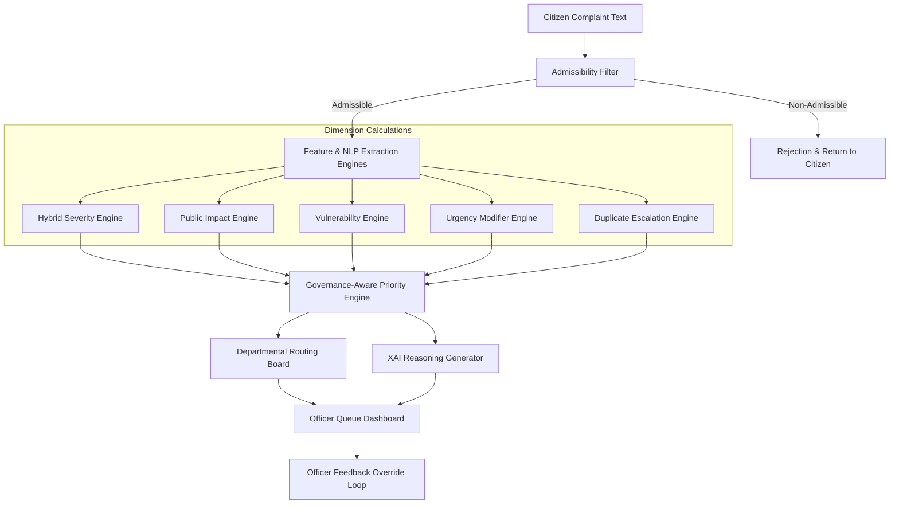

# Sahayak AI - Intelligent NLP-Driven Complaint Triage System

**A Governance-Aware Smart Prioritization and Automated Routing System for Digital Grievance Portal Middleware**

Sahayak AI is a high-performance NLP middleware prototype designed to solve the critical operational bottleneck of manual complaint processing in public governance. Instead of traditional FIFO (First-In, First-Out) processing, Sahayak AI acts as an intelligent triage Layer, dynamically calculating urgency, extracting assets, detecting duplicates, and routing claims to the relevant government departments in real-time.

---

## 🏛️ System Architecture & Triage Pipeline

Sahayak AI processes unstructured citizen complaints through a multi-stage NLP and machine learning pipeline, applying governance rules at every stage:



### 1. Admissibility Filter
The first line of defense. The system intercepts and filters out complaints that do not fall under the portal's jurisdiction:
* **Prohibited Domains**: RTI (Right to Information) requests, Subjudice/Court disputes, Domestic/Family conflicts, Religious matters, Government Employee Service matters (promotions/transfers), and National Integrity/Security affairs.
* **Mechanism**: A fast keyword-interceptor checks for explicit violations, followed by a trained **Logistic Regression classifier** predicting the category based on **SentenceTransformer** embeddings. Non-admissible complaints are immediately rejected with clear policy citations.

### 2. Category Classification & Automated Departmental Routing
Admissible complaints are classified into 9 administrative categories using a **Logistic Regression classifier** and automatically routed to the corresponding department:
* **Health** $\rightarrow$ Health Department
* **Public Safety** $\rightarrow$ Police & Disaster Response
* **Corruption** $\rightarrow$ Vigilance Bureau
* **Transport** $\rightarrow$ Transport & Traffic Authority
* **Electricity** $\rightarrow$ Electricity Utilities Board
* **Roads** $\rightarrow$ Public Works Department (PWD)
* **Education** $\rightarrow$ Education Department
* **Water** $\rightarrow$ Water & Sewerage Board
* **Sanitation** $\rightarrow$ Municipal Sanitation Department
* **Other** $\rightarrow$ General Administration Department

### 3. Named Entity Recognition (NER) & Asset Extraction
Powered by **spaCy** (`en_core_web_sm`) and custom regex matchers, the system extracts critical metadata:
* **Locations**: Identifies cities, neighborhoods, and Indian location suffixes (e.g., *Nagar, Pur, Ganj, Colony, Vihar, Sector, Phase*).
* **Primary Infrastructure Assets**: Identifies specific facilities affected, such as *Hospitals, Schools, Bridges, Flyovers, Roads, and Government Offices*.

---

## ⚖️ The 5-Factor Triage & Prioritization Logic

The core of Sahayak AI is its **Governance-Aware Priority Engine**. Instead of simple keyword counts, it computes a weighted priority index based on 5 dimensional scores $[0.00 - 1.00]$:

$$\text{Priority Score} = 0.30 \times \text{Severity} + 0.25 \times \text{Public Impact} + 0.20 \times \text{Urgency} + 0.15 \times \text{Vulnerability} + 0.10 \times \text{Duplicate Escalation}$$

### The 5 Triage Dimensions
1. **Severity (30% Weight)**: 
   * Calculated via a **Hybrid ML + Governance Heuristic Engine**. 
   * Combines an ML regressor (**RandomForestRegressor** trained on SentenceTransformer embeddings - **20% weight**) with deterministic governance heuristics (**80% weight**).
   * This guarantees that hard governance anchors are respected (e.g., minor streetlights always resolve to *Low* severity) while maintaining semantic flexibility for novel formulations.
2. **Public Impact (25% Weight)**:
   * Estimates the scale of disruption based on category scope, infrastructure proximity, and compound hazard conditions (e.g., a flash flood occurring near a hospital scales public impact to a maximum score of `0.90`).
3. **Urgency (20% Weight)**:
   * Adjusts the speed of response required. Factors in category baseline speed, emergency exclamation keywords (*ASAP, urgent, fatal, danger*), and proximity to critical installations.
4. **Vulnerability (15% Weight)**:
   * Scores the threat to vulnerable populations (hospitals, schools, senior citizen homes, emergency services) and high-severity hazard events (gas leaks, short circuits, fires).
5. **Duplicate Escalation (10% Weight)**:
   * Prevents system spam while leveraging public sentiment. Using **TF-IDF + Cosine Similarity** (threshold 0.70), similar complaints are clustered. The duplicate escalation score scales up dynamically with the frequency of duplicate reports (`1 report = 0.30`, `2 reports = 0.60`, `3 reports = 0.85`, `4+ reports = 1.00`) to highlight recurring hotspots.

### Priority Classifications
The final score is mapped directly to standard administrative action levels:
* **🚨 Critical**: $[0.75 - 1.00]$ — Immediate dispatch / life-safety risk
* **🔴 High**: $[0.50 - 0.749]$ — Urgent attention / major infrastructure failure
* **🟡 Medium**: $[0.30 - 0.499]$ — Scheduled repair / standard civic grievance
* **🟢 Low**: $[0.00 - 0.299]$ — Routine service / maintenance request

---

## 🏛️ Government Portal UI Overhaul

The interface has been redesigned to reflect a formal, secure, high-contrast **Government Middleware Administration Portal**:

1. **National Grievance Banner**: A dark-navy header block (`#0F294A`) bordered with saffron and green national stripes, providing a formal branding environment.
2. **Registry Stats & Formula Sidebar**: A clean sidebar displaying active middleware registry stats (logs processed, active queue length, officer overrides) alongside the mathematical priority formula for complete developer transparency.
3. **Triage Metrics Matrix Table**: When a citizen submits a complaint, the portal avoids basic summaries and displays a detailed evaluation grid. The matrix table shows base scores, weights, contributions, and the rationales behind each dimension.
4. **Official Triage Certificate Stamp**: Replaces consumer-style badges with a bordered, styled certificate stamp displaying the final priority rating and a clean **Explainable AI (XAI)** justification.
5. **Color-Coded Officer Queue**: Under the Officer Dashboard, active complaints are organized dynamically inside card layouts styled with high-contrast borders and indicators to ensure readability:
   * **Critical & High Priority**: Light red background (`#fff5f5`), solid pink border (`#feb2b2`), bold red headers (`#9b2c2c`), and a solid red accent indicator.
   * **Medium Priority**: Light yellow background (`#fefbeb`), gold border (`#fef3c7`), bold gold headers (`#b45309`), and a solid orange accent indicator.
   * **Low Priority**: Clean white background (`#ffffff`), light border (`#e2e8f0`), dark-gray headers, and a solid gray accent indicator.
6. **Officer Override & Feedback Loop**: Officers can manually override the AI-predicted priority. Any override triggers a mandatory text reason field, which is saved to the local database and can be exported as a CSV to retrain the models.

---

## 🔧 Technical Dependencies & Cloud Deployment Workarounds

Building and deploying NLP applications with PyTorch and spaCy on resource-constrained cloud environments (such as Streamlit Community Cloud) poses unique challenges. Sahayak AI incorporates robust, production-grade solutions for these issues:

### 1. Strict NumPy Compatibility Pinned
* **Problem**: Newer versions of NumPy (`>=2.0.0`) introduce binary incompatibility with legacy pre-compiled libraries used by `spaCy` and its underlying tensor package `thinc`, causing immediate runtime crashes on Linux servers. Additionally, scikit-learn models pickled on NumPy 2.x will crash on load if the server runs NumPy 1.x.
* **Solution**: Handled by restricting dependencies to `numpy>=1.24.0,<2.0.0` (pinned to `1.26.4`) in `requirements.txt`. All local model retraining must be conducted in this environment.

### 2. Device-Agnostic Model Serialization (MPS/CUDA Fix)
* **Problem**: Training and saving models on a macOS device with Apple Silicon utilizes the metal performance shaders (`mps` device) inside PyTorch. If the active `SentenceTransformer` object is pickled directly, it serializes Mac-specific device states. When deployed to a CPU-only Linux server (Streamlit Cloud), loading this model fails with a `RuntimeError` claiming the MPS device is not available. It also inflates the git repository size by saving 91MB of model weights.
* **Solution**: Implemented custom `__getstate__` and `__setstate__` methods in the `SentenceTransformerWrapper` class (`utils.py`). This prevents pickling the active PyTorch model weights. Only the configuration string (`model_name`) is serialized. When loaded, the model lazily initializes on whatever hardware is available (CPU, CUDA, or MPS), reducing the vectorizer file size from **91.4 MB** to **90 bytes** and making deployment instant.

### 3. Automated spaCy Model Fetching
* **Problem**: Streamlit Community Cloud runs headlessly and does not allow execution of manual setup commands like `python -m spacy download en_core_web_sm`.
* **Solution**: The required spaCy English pipeline wheel is linked directly inside `requirements.txt` via its GitHub release page, allowing the package manager to download and compile it automatically during build.

### 4. Lazy-Load Dependency Crashing (torchvision ModuleNotFoundError Fix)
* **Problem**: When deploying on Streamlit Cloud (using Python 3.14), Streamlit's internal `local_sources_watcher` scans all imported package modules to find their path. When it encounters a lazy-loaded module structure inside Hugging Face `transformers` (used by `sentence-transformers`), accessing its namespace triggers lazy-loading checks. One of the models (ZoeDepth) attempts to dynamically import `torchvision`, which throws `ModuleNotFoundError: No module named 'torchvision'` and crashes the app daemon startup.
* **Solution**: 
  1. Disabled the file system watcher by setting `watchFileSystem = false` under the `[server]` block in `.streamlit/config.toml`. This is highly recommended for production environments as it saves server resources.
  2. Added `torchvision` directly to `requirements.txt` to satisfy any lazy imports if the watcher is triggered elsewhere.

---


## 🚀 Quick Start Guide

### Prerequisites
* Python 3.8 to 3.11
* Pip package manager

### 1. Setup Environment & Install Dependencies
Navigate to your project directory and configure a virtual environment:
```bash
# Create virtual environment
python -m venv .venv

# Activate virtual environment
source .venv/bin/activate  # On Windows: .venv\Scripts\activate

# Install dependencies
pip install -r requirements.txt
```

### 2. Train the ML Models
Execute the training script to load the training dataset, train the classifiers, and save the pickle stores:
```bash
python model_training.py
```
This script will:
1. Load `ai_priority_training_dataset.csv`.
2. Generate target severities using governance rules.
3. Fetch and extract sentence embeddings.
4. Train the Category Classifier, Priority Classifier, and Severity Regressor.
5. Export `tfidf_vectorizer.pkl`, `category_classifier.pkl`, `priority_classifier.pkl`, and `severity_model.pkl`.

### 3. Run the Portal Locally
Launch the Streamlit web server:
```bash
streamlit run app.py
```
Or execute the automated automation script:
```bash
bash start.sh
```
Navigate to `http://localhost:8501` to access the portal.

---

## 📁 Directory Structure
```
Sahayak-AI/
├── app.py                           # Main portal app with Government UI & CSS styling
├── utils.py                         # Core NLP utility libraries (NER, Priority Engines)
├── model_training.py                # ML Model training script & synthetic generator
├── data_generator.py                # Synthesizer script for training data
├── start.sh                         # Automated installation and launch script
├── requirements.txt                 # Pinned dependencies & spaCy wheel url
├── .streamlit/
│   └── config.toml                  # Streamlit configuration forcing Light Mode
├── ai_priority_training_dataset.csv # Base dataset containing 1000 complaints
├── tfidf_vectorizer.pkl            # Serialized lazy-loading SentenceTransformer wrapper (90 bytes)
├── category_classifier.pkl         # Trained Category Classifier
├── priority_classifier.pkl         # Trained Priority Classifier
└── severity_model.pkl              # Trained Severity Regressor (Random Forest)
```

---

## 🧪 Demonstration Test Cases (Jury Walkthrough)

To demonstrate the full capability of the triage engines, try submitting these scenarios in the **Citizen Portal** and inspect the **Officer Dashboard**:

### 1. Low Severity Grievance (Streetlight Issue)
* **Input Text**: `"Street lights are broken and damaged in Anna Nagar Area, Madurai. People suffer a lot while passing through the street especially kids and women. Kindly consider."`
* **Expected Result**: **🟢 Low Priority** (~0.21)
* **Why**: The hybrid engine flags this as an electricity issue. The heuristic severity model overrides the base score to ensure standard streetlights are resolved as low severity.

### 2. Critical Public Safety Grievance (Gas Leak near School)
* **Input Text**: `"A dangerous gas leak has been detected near government primary school in Chennai. Students are experiencing breathing issues. Send immediate help."`
* **Expected Result**: **🚨 Critical Priority** (~0.82)
* **Why**: The vulnerability engine detects a school (vulnerable population) and a major hazard (gas leak). The public impact engine boosts the score because a public school is affected.

### 3. Critical Infrastructure Disaster (Flooding near Hospital)
* **Input Text**: `"Severe flooding on the main road causing traffic logjam near City General Hospital. Water is entering the emergency ward."`
* **Expected Result**: **🚨 Critical Priority** (~0.78)
* **Why**: The system triggers a compound modifier for flooding + hospital proximity, assigning maximum public impact and vulnerability boosts.

### 4. Duplicate Escalation Sequence
1. Submit this complaint once: `"Pothole on MG Road causing minor traffic delays."` $\rightarrow$ Priority: **Low** or **Medium** (Duplicate Escalation = `0.00`).
2. Submit the exact same complaint a second time.
3. Submit the same complaint a third time.
4. Go to the **Officer Dashboard**. You will observe that the Duplicate Escalation score has scaled up to `0.85+`, pushing the final priority level to **High** or **Critical** due to the volume of public reports.

---

**Built for enhanced public governance through Explainable AI**
